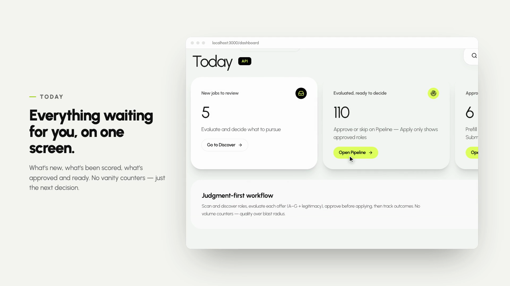

<div align="center">


### The job hunt, minus the admin.

**Shortlistr finds roles worth your time, judges them against your actual CV, and prepares the application, then stops and hands you the mouse.**

[](https://github.com/sarojgn810/shortlistr/raw/main/docs/assets/shortlistr-demo.mp4)

<sub><i>45 seconds of a real scan. Click to play.</i></sub>

[](LICENSE)
[](tests)
[](https://www.python.org/downloads/)
[](#privacy)

</div>

---

## Why this exists

Job hunting became a numbers game because the tools made it one. Mass-apply bots fire your CV at three hundred postings, and employers responded by filtering harder. Everyone spends more effort to get less signal.

Shortlistr is built the other way round. It reads a lot so you read a little.

```
Discover  →  Evaluate  →  Approve  →  Prep  →  Prefill  →  You click Submit
  11,535       A–G on        your        cover        form fields      always
  postings   your real CV    call     letter, Q&A     filled in         you
```

**It never submits anything.** There is no code path in the project that presses Send.

---

## What you get

|  | |
|---|---|
| **Searches where the jobs are** | Company career boards, aggregators, and the job alerts already sitting in your inbox. Keyword-first: it searches for your titles rather than downloading everything and filtering afterwards. |
| **Scoring you can check** | Every job gets an A–G evaluation against your real CV: role fit, requirements met and unmet with the evidence, comp and logistics, risks, application strategy, interview angles, and whether the posting is even legitimate. |
| **Prep about *this* job** | Cover letter, interview questions written from the actual job description, a study path from the gaps, and and a tailored CV PDF built from your own résumé. |
| **A tracker you can trust** | Pipeline from discovered to offer, follow-ups pulled from your inbox, and outcomes fed back into scoring. |
| **It stays on your disk** | SQLite file on your disk. No account, no telemetry, no server. Works offline with a local model if you want it to. |

---

## Quick start

```bash
git clone https://github.com/sarojgn810/shortlistr.git
cd shortlistr

pip3 install -r automation/requirements.txt   # Python packages
python3 -m automation.cli start               # everything else, then opens the app
```

`start` installs Node if it is missing, Playwright, and the dashboard, then opens onboarding at **http://localhost:3000**. It reinstalls the Python packages too, so the first line is belt and braces. Run it and any dependency problem shows up immediately instead of as a puzzling error later.

Upload your CV, confirm your target titles, add a free API key when it asks, and scan.

> **Windows:** double-click `start.bat`, or run `.\start.ps1`.
> **macOS/Linux:** `make start` does the same thing.

---

## API keys

Almost everything runs without an API key: discovery, filtering, the tracker, CV rendering, form prefill. Two free keys turn on the rest, and neither wants a card:

| Key | Unlocks | Free tier |
|---|---|---|
| [Google Gemini](https://aistudio.google.com/apikey) | Real scoring, cover letters, chat | ~1,500 requests/day |
| [Google Custom Search](https://programmablesearchengine.google.com/) | Interview research, prep reading list | 100 queries/day |

Without them nothing breaks. Scoring falls back to keyword matching and labels every card as such.

Prefer to stay fully offline? Local AI runs through [Ollama](https://ollama.com) with no account at all. It is slower and the analysis is thinner, and the app says so.

---

<div align="center">

**[Getting started →](GETTING_STARTED.md)** · **[Architecture →](docs/ARCHITECTURE.md)** · **[Contributing →](docs/CONTRIBUTING.md)**

</div>

---

## What it is / isn't

| It is | It is not |
|-------|-----------|
| A personal job-search pipeline on your laptop | A mass-apply bot |
| Discover + score + prep + form **prefill** | Auto-submit to LinkedIn, Naukri, or ATS forms |
| Optional Local AI / API keys / Apify | A hosted SaaS |
| MIT-licensed open source | Permission to violate third-party Terms of Service |

Sources are read the way each site asks to be read. Where a site's `robots.txt` disallows its listings, Shortlistr does not scrape it. Dice and Jobsora are both documented as declined in the source code rather than quietly worked around.

---

## Requirements

You need **Python 3.10+** on the machine before the one-liner will run.  
**Node.js 18+** is installed automatically by that command if it is missing.

| Tool | Version | Who installs it |
|------|---------|-----------------|
| Python | 3.10+ | **You**, once. See below if you have none. |
| Node.js | 18+ | **Shortlistr** via `start` (Homebrew / winget / portable `.tools/`) |
| Playwright Chromium | — | **Shortlistr** via `start` |

### If you have nothing installed yet

**1. Install Python 3.10+**

| Platform | Do this |
|----------|---------|
| macOS | [python.org/downloads](https://www.python.org/downloads/) **or** `brew install python` |
| Windows | [python.org/downloads](https://www.python.org/downloads/), tick **“Add python.exe to PATH”** |
| Linux | `sudo apt update && sudo apt install -y python3 python3-venv python3-pip` (or your distro’s Python 3.10+) |

Check: `python3 --version` (macOS/Linux) or `python --version` (Windows). It must be 3.10 or newer.

**2. Clone and start**: the command at the top of this page.

| Platform | Same one-liner |
|----------|----------------|
| macOS / Linux | `python3 -m automation.cli start` · or `make start` |
| Windows | `python -m automation.cli start` · or double-click `start.bat` / `.\start.ps1` |

That single command installs everything Shortlistr needs after Python is present: Node (if missing), Python packages, Playwright Chromium, dashboard deps, seeds placeholders, starts the API + dashboard, and opens **http://localhost:3000/onboarding**.

If Node auto-install fails, the launcher prints OS-specific fixes (`brew install node`, `winget install OpenJS.NodeJS.LTS`, or [nodejs.org](https://nodejs.org)).

**What `start` does**

1. Checks **Python 3.10+** (must already be installed, since you are running it)
2. **Installs Node.js automatically** if missing
3. Installs Python packages, Playwright Chromium, and dashboard deps
4. Seeds local placeholders (`cv.md`, `portals.yml`, `.env`, SQLite)
5. Starts API (`http://127.0.0.1:8787`) and dashboard (`http://localhost:3000`)
6. Opens **http://localhost:3000/onboarding**

Then finish the wizard: upload résumé → confirm titles/locations → scan.

Day-to-day setup (LLM key, Playwright, Apify, Gmail) lives in the dashboard **Connections** page, not in hand-edited shell commands.

---

## Demo script (≈5 minutes)

Happy path for a live demo on a second laptop:

1. **Install**: `python -m automation.cli start` (or `make start` / `start.bat`)
2. **Onboarding**: upload CV → confirm target titles + locations → Finish
3. **AI**: open **Connections** → paste a free [Gemini key](https://aistudio.google.com/apikey) (no card). `auto` uses your key first and falls back to Local AI only if you set it up.
4. **Discover**: open Discover → Scan → wait for inbox cards (list stays slim, no full eval JSON blobs)
5. **Approve**: Approve or Skip (optimistic UI; you always click Submit later)
6. **Prep**: open an approved role → Prep for cover letter / reach-out (never auto-sent)

Without an AI key, chat still answers basic commands (`status`, `inbox`, `discover`) and points at Connections. It never fails silently.

---

## How the pipeline works

```
Setup → Discover → Evaluate → Approve → Prep → Apply assist → You Submit
```

1. **Discover**: company watchlist (`portals.yml`), Workday, aggregators, LinkedIn guest, Gmail job alerts, optional Naukri/Apify  
2. **Filter**: only roles matching your preferred titles and locations (e.g. Bangalore + Remote India, not worldwide remote)  
3. **Evaluate**: CV vs JD (LLM or heuristic)  
4. **Approve**: you choose what is worth applying to  
5. **Prep**: cover letter / interview notes  
6. **Apply assist**: prefill the form in a browser; **you** click Submit  

Add employers in `portals.yml` (start from `templates/portals.example.yml`). Keep it a short personal watchlist.

---

## Tuning what you see

Step 2 is where almost all tuning happens, and it is the first thing to check if
Discover looks empty or noisy. A scan typically fetches 10,000+ postings and
keeps a few dozen; `config/profile.yml` decides which.

```yaml
filters:
  target_titles:          # a posting must contain one of these to survive
    - "Site Reliability Engineer"
    - "Platform Engineer"
  exclude_titles:         # ...and none of these
    - "Manager"
    - "Director"
```

**Titles are matched as substrings, so list the shortest form.** `"Site
Reliability Engineer"` already covers *Senior*, *Staff* and *Principal*, so adding
those as separate entries does nothing.

**Too few jobs?** Add the other names for your work. Titles are the first gate,
so anything not listed is dropped before it is ever scored. A search for only
`"Site Reliability Engineer"` never sees *Platform Engineer*, *Infrastructure
Engineer* or *DevOps Engineer*, which are often the same job. Widening a real
profile from 8 narrow titles to 14 took a scan from 46 kept to 129.

**Too much noise?** That is `exclude_titles`, matched against the **job title
only**. Broad title matching also catches the management version of the same
words: `"Platform Engineer"` matches *Platform Engineering Manager*.

> **Do not put role words in `deal_breakers`.** Those match the title *and the
> whole job description*, which is right for `"recruiter"` or `"15+ years"` and
> wrong for `"Manager"`: on a real inbox, 27 of 161 postings mentioned a manager
> somewhere in the body and only 6 were management roles. It would have thrown
> away 21 genuine engineering jobs for saying "you will report to the
> engineering manager". Use `exclude_titles` for role words.

Locations work the same way via `preferred_locations`.

Two scoring bars sit under `scoring:`. `min_fit_score` (default 40) is the floor
for keeping a job at all; `strong_fit_score` (default 70) is the "look at these
first" bar reported as **strong fit** after each scan. Keep them apart. Set
them equal and strong fit just restates how many were kept. A job cannot exceed
60 before its description is fetched, so a strong-fit bar at or below 60 would
mark everything strong the moment it was discovered.

Restart the API after editing. The profile is read at startup.

---

## Privacy

| Stays on your disk (gitignored) | Never sent to us |
|--------------------------------|------------------|
| `cv.md`, `config/profile.yml`, `.env` | No telemetry |
| `portals.yml`, `data/shortlistr.db` | No outbound account |
| `reports/`, `output/`, `interview-prep/` | Secrets via `.env` / OS keychain only |

A fresh clone has **placeholders only**. Do not commit résumés, phone numbers, or API keys.

---

## Legal & ethics

**You** must comply with the Terms of Service of LinkedIn, Naukri, Indeed, Apify, Greenhouse, Lever, and every employer ATS you use.

- Scrapers and Apify are **opt-in** and at **your own risk**. Prefer careers pages in `portals.yml` and public ATS APIs when you can.
- MIT licenses **this code**. It is not a license to break site ToS or the law.
- Shortlistr **never auto-submits**. Prefer fit ≥ 4.0/5 before applying.

---

## Common commands

```bash
make start                 # install + seed + run + open /onboarding
make dev                   # start API + scheduler + dashboard (already installed)
make doctor                # environment check
make test                  # pytest
make scan                  # run discovery once
make reset                 # wipe job data / profile to a blank slate (keeps .env)
make uninstall             # remove Shortlistr from this machine (see below)
make uninstall ARGS=--purge-data   # uninstall + delete résumé, DB, .env, etc.
```

| Goal | Command |
|------|---------|
| Use Shortlistr again tomorrow | `make dev` (or leave the stack running) |
| Clear jobs and re-onboard | `make reset` |
| Remove Shortlistr completely | `make uninstall`, then delete the folder |

---

## Uninstall / remove Shortlistr

Use this when you want Shortlistr **off the machine**, not just a blank profile.

### 1. Guided cleanup (from the project folder)

```bash
# Stops local servers, removes Shortlistr cron hooks, clears Shortlistr keychain
# secrets, and removes node_modules / build caches. Prints final steps.
make uninstall

# Same, and also permanently deletes résumé, profile, DB, .env, portals.yml,
# and reset backups (cannot undo):
make uninstall ARGS=--purge-data
```

Windows (PowerShell):

```powershell
python -m automation.cli uninstall
python -m automation.cli uninstall --purge-data
```

### 2. Delete the project folder

`make uninstall` does **not** delete the repository directory. Remove it yourself:

```bash
# macOS / Linux, from the PARENT of the clone
cd ..
rm -rf shortlistr          # use your actual folder name
```

```powershell
# Windows, from the parent folder
Remove-Item -Recurse -Force .\shortlistr
```

### 3. Optional extras

Only if you installed these for Shortlistr:

```bash
# Playwright Chromium browser cache
python3 -m playwright uninstall chromium

# Local AI models (Ollama)
ollama list
ollama rm <model-name>

# Python packages from this project (run before deleting the folder)
pip3 uninstall -y -r automation/requirements.txt
```

System Python and Node can stay. Shortlistr does not require uninstalling them.

### What is removed vs kept

| Removed by `make uninstall` | Kept until you delete the folder | Optional / manual |
|-----------------------------|----------------------------------|-------------------|
| Processes on `:3000` / `:8787` | Source code + templates | Playwright Chromium cache |
| Shortlistr crontab lines | `cv.md`, profile, DB (unless `--purge-data`) | Ollama models |
| OS keychain secrets (`shortlistr`) | `.env` / `portals.yml` (unless `--purge-data`) | System Python / Node |
| `node_modules` / build caches | | |

More detail: [GETTING_STARTED.md §7](GETTING_STARTED.md#7-uninstall--remove-shortlistr-completely).

---

## Optional extras

- **Local AI**: Connections can install a small on-device model, so evaluations, cover letters and prep run with no cloud key. **If you already use Ollama, Shortlistr picks up a model you have pulled.** It does not insist on downloading its own, and it skips models too large for your RAM. Cloud LLM keys remain optional for richer evaluations.
- **Web search key**: optional but unlocks three things at once: the interview-prep reading list, the "how this company interviews" section, and the `search` discovery source. Free DuckDuckGo is used first and is frequently bot-challenged (HTTP 202), in which case those sections say so rather than inventing links. Add a free **Google Custom Search** key under **Connections → Web search** (~100 queries/day): create an engine at [programmablesearchengine.google.com](https://programmablesearchengine.google.com/), paste the site list the Connections page shows into **Sites to search**, copy the **Search engine ID (CX)**, then enable the [Custom Search API](https://console.cloud.google.com/apis/library/customsearch.googleapis.com) and create an API key. Paste both into Connections.

  > Google retired *"Search the entire web"* for **new** engines on 20 Jan 2026. A new engine must name up to 50 domains instead, and existing whole-web engines keep working until 1 Jan 2027. That cap is not a problem here: Shortlistr already filters results down to about 33 hosts, and Connections shows the exact list to paste.
- **Gmail**: ingest job-alert emails (read + unread, last 7 days) from Connections.
- **Apify**: optional paid board scrapers; free credit is often enough for personal use.
- **Page reader**: optional boost under **Connections → Page reader**. When plain HTTP returns an empty SPA shell (or a hard block), Shortlistr tries a readable snapshot before Playwright. No API key and nothing to install. Or set `SHORTLISTR_PAGE_READER=1`. Cloners who skip this keep requests, then Playwright.
- **Company watchlist**: edit `portals.yml` for careers URLs you care about.

---

## Docs

| Doc | Contents |
|-----|----------|
| [GETTING_STARTED.md](GETTING_STARTED.md) | First run, reset, uninstall |
| [docs/ARCHITECTURE.md](docs/ARCHITECTURE.md) | Stack and data flow |
| [docs/CONTRIBUTING.md](docs/CONTRIBUTING.md) | PRs, tests, no personal data |
| [AGENTS.md](AGENTS.md) | Rules for AI assistants in this repo |
| [CODE_OF_CONDUCT.md](CODE_OF_CONDUCT.md) | Contributor Covenant |
| [SECURITY.md](SECURITY.md) | Vulnerability reports |
| [LICENSE](LICENSE) | MIT |

---

## License

MIT. See [LICENSE](LICENSE).

MIT does **not** grant rights under LinkedIn, Naukri, Apify, or employer Terms of Service. Use ethically; never auto-submit.

---

## Author

Built by [sarojnayak.com](https://www.sarojnayak.com)
